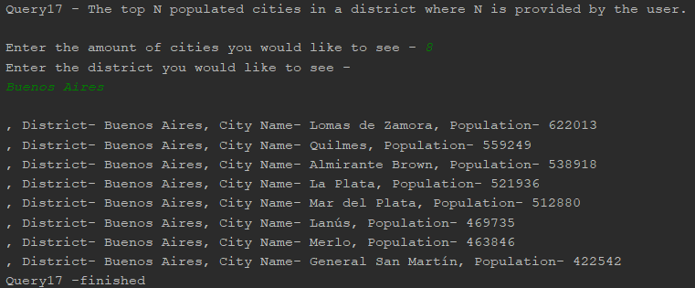
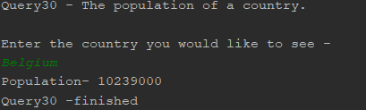

# Software Engineering Methods

| Master | Develop | Licence | Release |
|--------|---------|---------|---------|
|  || |  |
|  |  | | | 

22 requirements of 32 have been implemented, which is 68.75%

| ID | Name | Met | Screenshot |
| --- | --- | --- | --- |
| 1 | All the countries in the world organised by largest population to smallest. | YES | Query 2  |
| 2 | All the countries in a continent organised by largest population to smallest. | YES | Query 3  |
| 3 | All the countries in a region organised by largest population to smallest. | YES | Query 4  |
| 4 | The top N populated countries in the world where N is provided by the user. | YES | Query 5  |
| 5 | The top N populated countries in a continent where N is provided by the user. | YES | Query 6  |
| 6 | The top N populated countries in a region where N is provided by the user. | YES | Query 7  |
| 7 | All the cities in the world organised by largest population to smallest. | YES | Query 8  |
| 8 | All the cities in a continent organised by largest population to smallest. | YES | Query 9  |
| 9 | All the cities in a region organised by largest population to smallest. | YES | Query 10  |
| 10 | All the cities in a country organised by largest population to smallest. | YES | Query 11  |
| 11 | All the cities in a district organised by largest population to smallest. | YES | Query 12  |
| 12 | The top N populated cities in the world where N is provided by the user. | YES | Query 13  |
| 13 | The top N populated cities in a continent where N is provided by the user. | YES | Query 14  |
| 14 | The top N populated cities in a region where N is provided by the user. | YES | Query 15  |
| 15 | The top N populated cities in a country where N is provided by the user. | YES | Query 16  |
| 16 | The top N populated cities in a district where N is provided by the user. | YES | Query 17  |
| 17 | All the capital cities in the world organised by largest population to smallest. | No |  |
| 18 | All the capital cities in a continent organised by largest population to smallest. | No |  |
| 19 | All the capital cities in a region organised by largest to smallest. | No |  |
| 20 | The top N populated capital cities in the world where N is provided by the user. | No |  |
| 21 | The top N populated capital cities in a continent where N is provided by the user. | No |  |
| 22 | The top N populated capital cities in a region where N is provided by the user. | No |  |
| 23 | The population of people, people living in cities, and people not living in cities in each continent. | No |  |
| 24 | The population of people, people living in cities, and people not living in cities in each region. | No  |  |
| 25 | The population of people, people living in cities, and people not living in cities in each country. | No |  |
| 26 | The population of the world. | YES  | Query 27  |
| 27 | The population of a continent. | YES | Query 28  |
| 28 | The population of a region. | YES | Query 29  |
| 29 | The population of a country. | YES | Query 30  |
| 30 | The population of a district. | YES | Query 31  |
| 31 | The population of a city. | Yes | Query 32  |
| 32 | The number of people who speak Chinese, English, Hindi, Spanish and Arabic from greatest number to smallest, including the percentage of the world population. | No |  |

| Name | Code Review 1 | Code Review 2 | Code Review 3 | Code Review 4 | Final Deliverable | Average |
|------|---------------|---------------|---------------|---------------|-------------------|-------|
| Lauren Anderson | 0.5 | 0.5 | 0.5 | 0.5 | 0.75 | 0.55 |
| Calum Scott | 0.5 | 0.5 | 0.5 | 0.5 | 0.25 | 0.45 |
| Aidan Goldie | 0.0 | 0.0 | 0.0 | 0.0 | 0.0 | 0.00 |
| Gavin Blair | 0.0 | 0.0 | 0.0 | 0.0 | 0.0 | 0.00 |
